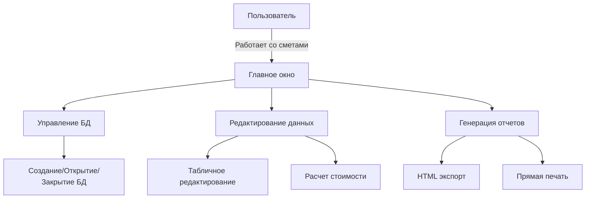
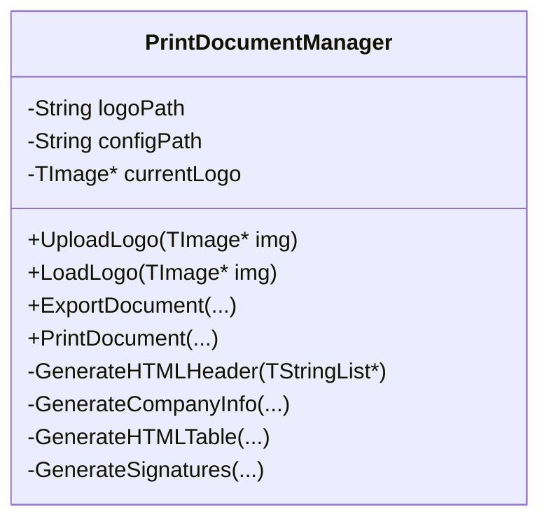
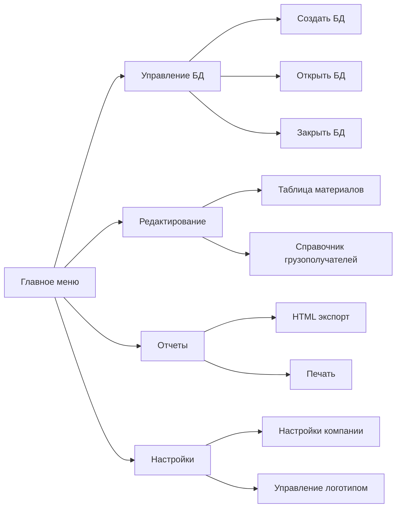
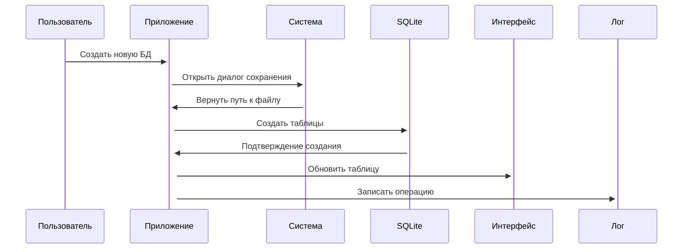
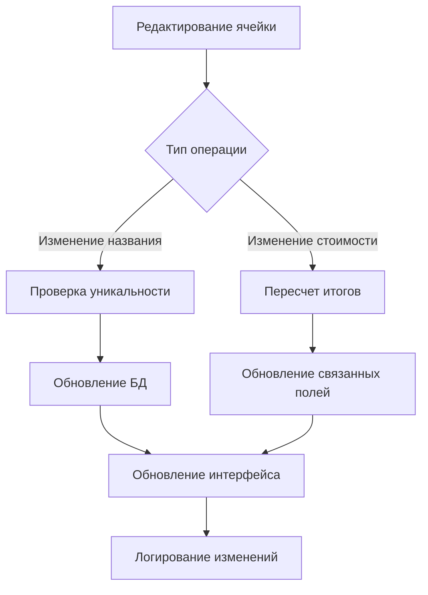
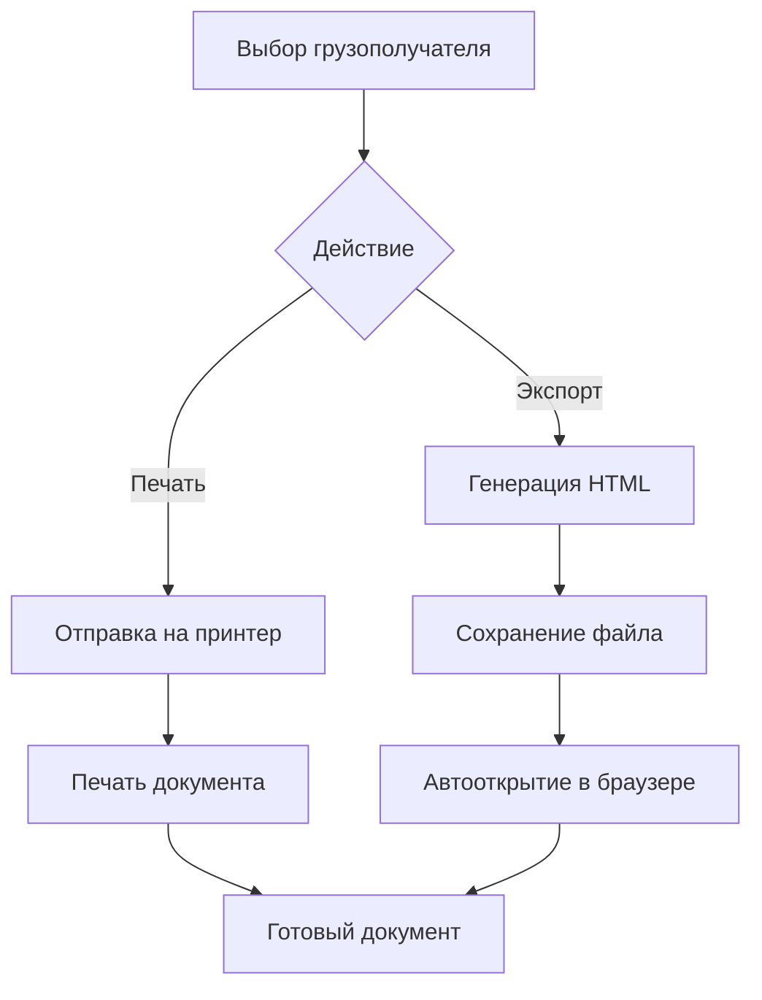

# 🧾 Smeta - Профессиональное приложение для управления сметами расходов

## 🚀 Обзор проекта
Smeta - это мощное Windows-приложение для управления сметами расходов на материалы с расширенными возможностями генерации отчетов. Программа позволяет:
- Создавать и редактировать базы данных смет
- Управлять справочником грузополучателей
- Генерировать профессиональные отчеты в HTML
- Выполнять печать документов напрямую из приложения
- Автоматизировать расчеты стоимости материалов



## ✨ Ключевые возможности

### 📊 Управление базами данных
- Создание/открытие/закрытие баз данных SQLite
- Автоматическое создание структуры таблиц
- Валидация имен файлов БД

### ✏️ Редактирование данных
- Табличное представление смет
- Динамическое изменение размеров таблицы
- Поиск и фильтрация данных
- Валидация вводимых значений

### 📝 Формирование документов
- Генерация профессиональных HTML-отчетов
- Настройка фирменного стиля (логотип)
- Автоматическая печать документов
- Поддержка подписей и дат

### 👥 Управление контрагентами
- Ведение справочника грузополучателей
- Валидация контактных данных
- Автоматическое заполнение информации

## ⚙️ Технологический стек
- **Язык программирования**: C++ (Embarcadero C++ Builder)
- **Базы данных**: SQLite
- **Графический интерфейс**: VCL (Visual Component Library)
- **Дополнительные технологии**:
  - FireDAC Database Components
  - System.IOUtils для работы с файлами
  - System.RegularExpressions для валидации
  - ShellAPI для интеграции с ОС

## 🧩 Основные компоненты системы

### 🧾 Consignee.h - Модель грузополучателя
```cpp
class Consignee {
public:
    String Name;        // Название организации
    String Address;     // Полный адрес
    String PhoneNumber; // Контактный телефон
    
    Consignee() {}
    Consignee(String name, String address, String phone)
        : Name(name), Address(address), PhoneNumber(phone) {}
};
```
Инкапсулирует данные о грузополучателе с валидацией:
- Проверка обязательных полей
- Форматирование телефонных номеров
- Валидация структуры адреса

### 🔧 function.h/cpp - Бизнес-логика
**Ключевые функции:**
```cpp
// Получение пути к БД через диалог выбора
String GetDatabasePath(bool forCreate, const String &initialDir);

// Создание таблиц в БД
bool CreateTable(TFDQuery *query, String ParamCreate, String SQLq);

// Загрузка данных из БД в интерфейс
bool LoadDataFromDB(TSpinEdit*, TSpinEdit*, TStringGrid*, TFDQuery*, 
                   std::vector<String> &, const String &tableName);

// Расчет итоговой стоимости
void SumCol(TStringGrid *StringGrid1, TSpinEdit*, TSpinEdit*);
```

### 🖨️ PrintDocumentManager.h/cpp - Генератор отчетов

**Основной функционал:**
- Генерация HTML с профессиональным оформлением
- Автоматическое добавление логотипа
- Формирование блоков подписей
- Поддержка печати напрямую из приложения

### 🖥️ MainForm.h/cpp - Ядро приложения
**Архитектура главного окна:**


**Особенности реализации:**
- Динамическая инициализация компонентов
- Валидация данных:
  ```cpp
  bool TForm1::ValidateAddress(String address) {
      bool hasCity = address.Pos("г.") > 0;
      bool hasStreet = address.Pos("ул.") > 0;
      bool hasHouse = address.Pos("д.") > 0;
      
      if (!hasCity || !hasStreet || !hasHouse) {
          ShowMessage("Адрес должен содержать: г., ул., д.");
          return false;
      }
      return true;
  }
  ```
- Логирование всех операций
- Обработка исключений

## 🚀 Рабочий процесс приложения

### 📂 Создание и управление БД


### ✏️ Редактирование данных


### 📄 Генерация отчетов
**Процесс формирования документов:**


**Этапы генерации HTML:**
1. Формирование HTML-заголовка с CSS-стилями
2. Добавление информации о компаниях (грузоотправитель/получатель)
3. Создание таблицы материалов с автоматическими расчетами
4. Вставка блока подписей и даты составления
5. Сохранение в файл с кодировкой UTF-8

## 🛠️ Инструкция по запуску
1. Клонируйте репозиторий
2. Откройте проект в Embarcadero C++ Builder
3. Настройте пути к библиотекам
4. Соберите решение (Build Project)
5. Запустите приложение

**Основные сценарии использования:**
1. Создание новой сметы:
   - Файл → Создать БД
   - Задайте имя файла
   - Заполните таблицу материалами

2. Работа с грузополучателями:
   - Перейдите на вкладку "Грузополучатели"
   - Добавьте/удалите контрагентов
   - Заполните реквизиты

3. Генерация отчета:
   - Отчеты → Экспорт в HTML
   - Выберите грузополучателя
   - Сохраните отчет

## 📬 Контакты и поддержка
По вопросам сотрудничества и поддержки проекта обращайтесь:

- **Email**: support@smetasoft.com
- **Телефон**: +7 (495) 123-4567
- **GitHub Issues**: https://github.com/smetasoft/smeta/issues

---

**Лицензия: MIT License**  
**Версия: 1.0.0**  
© 2025 SmetaSoft. Все права защищены.