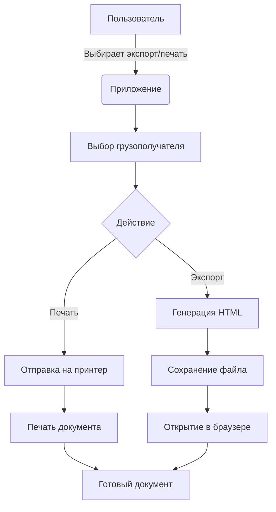

# 🧾 Smeta - Приложение для управления сметами расходов

## 🚀 Обзор проекта
Smeta - это профессиональное Windows-приложение для управления сметами расходов на материалы. Программа позволяет:
- Создавать и редактировать базы данных смет
- Управлять справочником грузополучателей
- Генерировать профессиональные отчеты в HTML
- Выполнять печать документов напрямую из приложения
- Автоматизировать расчеты стоимости материалов

## ✨ Ключевые возможности
- **Управление базами данных**
  - Создание/открытие/закрытие баз данных SQLite
  - Табличное редактирование смет
  - Автоматические расчеты стоимости материалов
  
- **Работа с контрагентами**
  - Ведение справочника грузополучателей
  - Хранение контактных данных
  - Валидация адресов
  
- **Формирование документов**
  - Генерация HTML-отчетов
  - Настройка фирменного стиля (логотип)
  - Автоматическая печать документов
  - Профессиональное оформление с подписями

## ⚙️ Технологический стек
- **Язык программирования**: C++ (Embarcadero C++ Builder)
- **Базы данных**: SQLite
- **Интерфейс**: VCL (Visual Component Library)
- **Форматы данных**: HTML, INI-конфиги
- **Зависимости**:
  - FireDAC Database Components
  - VCL Controls
  - System.RegularExpressions

## 🛠️ Структура проекта
```bash
Smeta/
├── data/               # Каталог данных
│   ├── db/             # Базы данных SQLite
│   ├── config.ini      # Конфигурация приложения
│   └── logo.png        # Фирменный логотип
├── Win32/              # Сборки приложения
│   └── Debug/          # Debug-версия
├── Consignee.h         # Класс грузополучателя
├── EditForm.*          # Форма редактирования
├── function.*          # Вспомогательные функции
├── MainForm.*          # Главная форма приложения
└── PrintDocumentManager.* # Генератор документов
```

## 🧩 Основные компоненты

### 🧾 Consignee.h
```cpp
class Consignee {
public:
    String Name;
    String Address;
    String PhoneNumber;
    // Конструкторы
    Consignee() {}
    Consignee(String name, String address, String phone)
        : Name(name), Address(address), PhoneNumber(phone) {}
};
```
Инкапсулирует данные о грузополучателе:
- Название организации
- Полный адрес
- Контактный телефон

### 🧮 function.h/cpp
**Ключевые функции:**
```cpp
// Получение пути к БД
String GetDatabasePath(bool forCreate, const String &initialDir);

// Работа с таблицами
bool CreateTable(TFDQuery *query, String ParamCreate, String SQLq);

// Загрузка данных
bool LoadDataFromDB(TSpinEdit *SpinEdit1, TSpinEdit *SpinEdit2, 
                   TStringGrid *StringGrid, TFDQuery *query,
                   std::vector<String> &_columnNames, 
                   const String &tableName);

// Расчеты
void SumCol(TStringGrid *StringGrid1, TSpinEdit *SpinEdit1, TSpinEdit *SpinEdit2);
```

### 🖨️ PrintDocumentManager.h/cpp
**Основной функционал:**
```cpp
class PrintDocumentManager {
public:
    PrintDocumentManager();
    void UploadLogo(TImage* img);  // Загрузка логотипа
    void LoadLogo(TImage* img);    // Загрузка логотипа
    
    // Генерация документов
    void ExportDocument(TStringGrid* grid, const String& sumValue,
                      const String& documentTitle,
                      const Consignee& sender,
                      const Consignee& receiver);
                      
    void PrintDocument(TStringGrid* grid, const String& sumValue,
                     const String& documentTitle,
                     const Consignee& sender,
                     const Consignee& receiver,
                     const String& fileName);
};
```

### 🖥️ MainForm.h/cpp
**Особенности реализации:**
- Инициализация приложения и БД
- Управление интерфейсом
- Обработка событий
- Интеграция всех компонентов
- Валидация данных:
  ```cpp
  bool TForm1::ValidateAddress(String address) {
      bool hasCity = address.Pos("г.") > 0;
      bool hasStreet = address.Pos("ул.") > 0;
      bool hasHouse = address.Pos("д.") > 0;
      // ...
  }
  ```

## 🚀 Запуск и использование
1. Клонируйте репозиторий
2. Откройте проект в Embarcadero C++ Builder
3. Соберите решение (Build)
4. Запустите приложение
5. Основные действия:
   - Создайте новую базу смет
   - Заполните данные о материалах
   - Добавьте грузополучателей
   - Сгенерируйте отчет/печать

## 📄 Генерация документов
Процесс формирования документов:



**Этапы генерации HTML:**
1. Формирование HTML-заголовка с CSS-стилями
2. Добавление информации о компаниях (грузоотправитель/получатель)
3. Создание таблицы материалов с автоматическими расчетами
4. Вставка блока подписей и даты составления
5. Сохранение в файл с кодировкой UTF-8

## 📬 Контакты
По вопросам сотрудничества и поддержки проекта обращайтесь:
- Email: example@domain.com
- GitHub Issues: https://github.com/yourusername/smeta/issues

---

**Лицензия: MIT**  
© 2025 Smeta Project Team. Все права защищены.